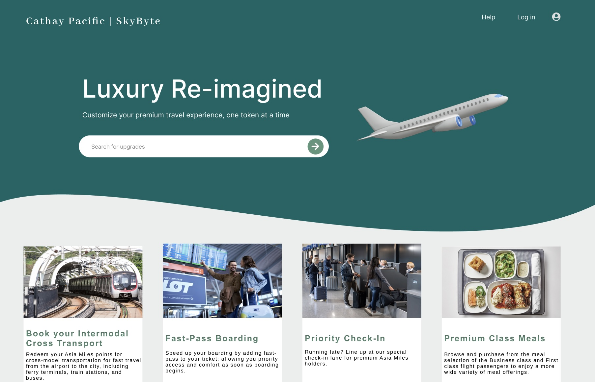

<div align="center">

# SkyByte - Luxury Reimagined 

*Customize your premium travel experience, One Token at a Time*

[Overview](#overview) • [Features](#core-features) • [Benefits](#benefits) • [Getting Started](#getting-started)

</div>

---

## Overview

SkyByte revolutionizes travel across the Greater Bay Area by combining seamless intermodal transportation with premium experiences. Our platform transforms Asia Miles redemption through a tokenized system that connects various transportation modes (air, rail, ferry) while offering luxury services, creating an integrated journey from start to finish.




## Core Features

### Intermodal Integration
<details>
<summary><b>Multi-Modal Connections</b></summary>

- Air-to-Rail transfers
- Ferry connections
- Local transit integration
- Cross-border transportation
</details>

<details>
<summary><b>Smart Routing</b></summary>

- Real-time schedule coordination
- Optimized transfer times
- Alternative route suggestions
- Dynamic pricing across modes
</details>

### Premium Travel Experience
<details>
<summary><b>LuxByte Tokens System</b></summary>

- Fast-pass boarding for all transport modes
- Premium waiting lounges at stations
- Priority check-in across stations
- Cross-border luggage delivery
</details>

###  Regional Coverage
- Macau Stations
- Hong Kong Transit Points
- Guangdong Transportation Hubs
- Greater Bay Area Connectivity

## Benefits

### For Passengers
| Benefit | Description |
|---------|-------------|
| Seamless Transfers | Smooth transitions between different transport modes |
| Unified Booking | Single platform for all transportation needs |
| Flexible Redemption | Use Asia Miles across various transport options |
| Premium Access | Luxury services available at strategic points |
| Cost Optimization | Dynamic pricing across different transport modes |

### For Transportation Partners
- **Increased Revenue**: New monetization opportunities
- **Resource Optimization**: Better capacity utilization
- **Data Insights**: Cross-modal passenger behavior analysis
- **Enhanced Loyalty**: Integrated rewards program

## Implementation Strategy

### Technical Architecture
SkyByte Platform
- Intermodal Routing Engine
- LuxByte Token System
- Transport Provider Integration
- Real-time Schedule Manager
- Super-App Integration (Meituan & Dianping)

### System Components
- Multi-modal booking interface
- Real-time transportation updates
- Dynamic mile redemption calculator
- Premium service marketplace

## Getting Started

**Clone the repository:**

``` 
git clone https://github.com/tanyabudhrani/SkyByte.git
```

**Install dependencies:**

```
   cd SkyByte
   npm install
```

**Run the development server:**

```
   npm start
```
<div align="center">
